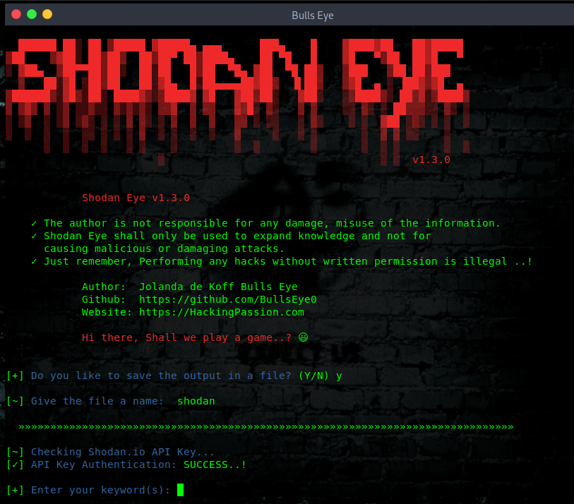
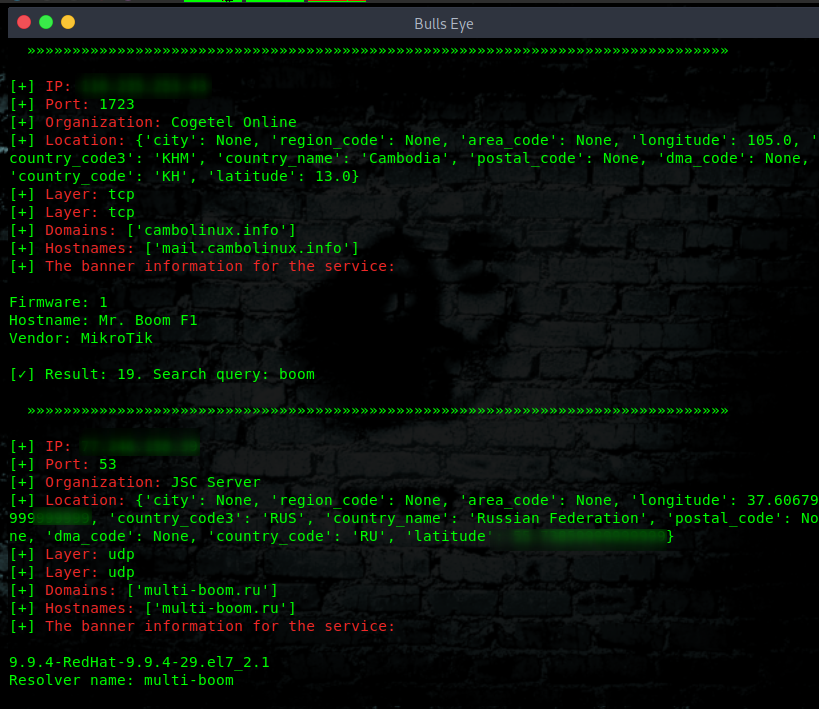
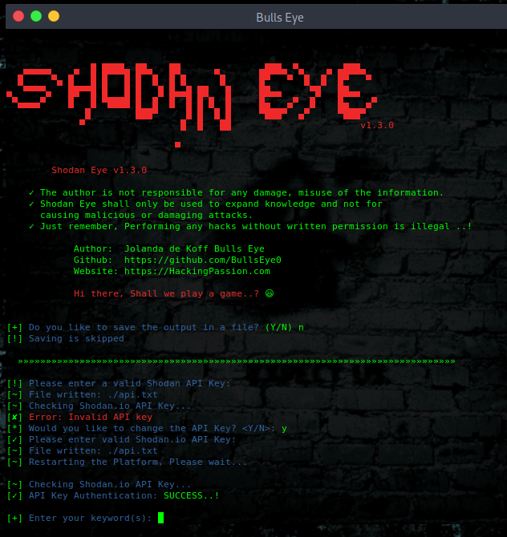

# Shodan Eye
This tool collects all information about all devices that are directly connected to the internet with the specified keywords that you enter. This way you get a complete overview.
****

Here you can read the latest article about Shodan Eye:

https://hackingpassion.com/shodan-eye-ethical-hacking-tool-release/
****
Article Install Shodan Eye on Termux can be found here:

https://hackingpassion.com/android-hacking-with-termux/#INSTALL_SHODAN_EYE
****

The types of devices that are indexed can vary enormously: from small desktops, refrigerators to nuclear power plants and everything in between. You can find everything using "your own" specified keywords. Examples can be found in a file that is attached:

The information obtained with this tool can be applied in many areas, a small example:
* Network security, keep an eye on all devices in your company or at home that are confronted with internet.
* Vulnerabilities.
And so much more.
****

# Shodan Eye Ethical Hacking Tool Release
Before we start the year 2020, today there is a new big release ..! 
Please note, if you have already installed Shodan Eye on your computer, then it is worthwhile to read it carefully. Of course, even if you don’t know this Shodan tool yet.

* Shodan Eye goes from python 2 to python 3
* Save the output of the Shodan Eye results
* The entry of the Shodan password is no longer visible.

# Shodan 
Is a search engine that lets the user find specific types of computers (webcams, routers, servers, etc.) connected to the internet using a variety of filters. Some have also described it as a search engine of service banners, which are metadata that the server sends back to the client.

***What is the difference between Google or another search engine:***
The most fundamental difference is that Shodan Eye crawls on the internet, Google on the World Wide Web. However, the devices that support the World Wide Web are only a small part of what is actually connected to the Internet.
****

## Shodan
For additional data gathering, you can enter a Shodan API key when prompted.
A Shodan API key can be found here: https://account.shodan.io/register
****

## A collection of search queries for Shodan is attached:
Shodan Dorks ... The Internet of Sh*t
* https://github.com/BullsEye0/shodan-eye/blob/master/Shodan_Dorks_The_Internet_of_Sh*t.txt
****

## I also want to make you aware that:
* This was written for educational purpose and pentest only.
* The author will not be responsible for any damage ..!
* The author of this tool is not responsible for any misuse of the information.
* You will not misuse the information to gain unauthorized access.
* This information shall only be used to expand knowledge and not for
causing malicious or damaging attacks.
* Performing any hacks without written permission is illegal ..!
****

****

****

****
## Video Shodan Eye on YouTube:
[Link to: Shodan Eye on YouTube](https://youtu.be/fOqmlOLiMsQ "Shodan Eye on YouTube")

****

# Install Shodan Eye on Linux:
****

Shodan Eye has tested it so far on:

**Linux**
Kali Linux
Parrot Security OS
BlackArch
Ubuntu
Arch-based
Debian-based

**Termux**
**Windows**

This list would be expanded

****
git clone https://github.com/BullsEye0/shodan-eye.git

cd shodan-eye

pip3 install -r requirements.txt
****

# How to use Shodan Eye
python3 shodan_eye.py

(You will be asked for a Shodan API key)

Have fun ..! 😃
****

# Contact to coder
Social Networks - Connect

* Website [HackingPassion.com](https://hackingpassion.com)

* [Facebook Personal](https://www.facebook.com/jolandadekoff)

* [linkedin](https://www.linkedin.com/in/jolandadekoff/)

* [Youtube](https://youtu.be/XCtWM-4ov2U)

* [Facebook Page](https://www.facebook.com/ethical.hack.group)

* [Facebook Group](https://www.facebook.com/groups/ethical.hack.group/)

## Buy me a coffee
I have developed Shodan Eye because I am passionate about this. 
Donations are one of the many ways to support what I do.

