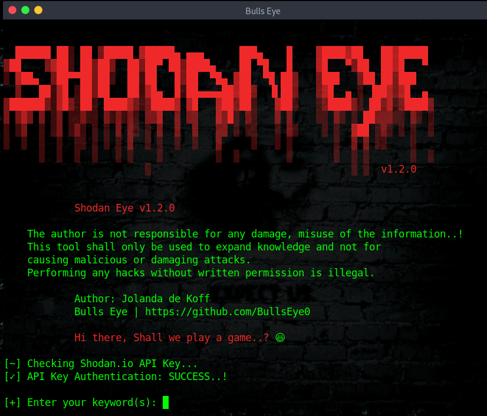
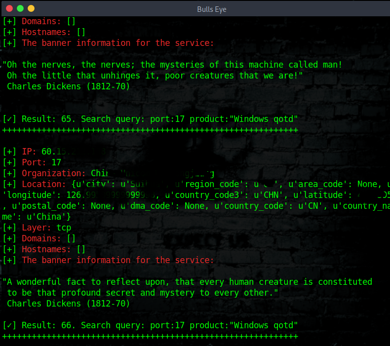

# Shodan Eye
This tool collects all information about all devices that are directly connected to the internet with the specified keywords that you enter. This way you get a complete overview.

The types of devices that are indexed can vary enormously: from small desktops, refrigerators to nuclear power plants and everything in between. You can find everything using "your own" specified keywords. Examples can be found in a file that is attached:

The information obtained with this tool can be applied in many areas, a small example:
* Network security, keep an eye on all devices in your company or at home that are confronted with internet.
* Vulnerabilities.
And so much more.

***What is the difference between Google or another search engine:***
The most fundamental difference is that Shodan Eye crawls on the internet, Google on the World Wide Web. However, the devices that support the World Wide Web are only a small part of what is actually connected to the Internet.
****
## Shodan
For additional data gathering, you can enter a Shodan API key when prompted.
A Shodan API key can be found here: https://account.shodan.io/register
****
## A collection of search queries for Shodan is attached:
Shodan Dorks ... The Internet of Sh*t
* https://github.com/BullsEye0/shodan-eye/blob/master/Shodan_Dorks_The_Internet_of_Sh*t.txt
****
## I also want to make you aware that:
* This was written for educational purpose and pentest only.
* The author will not be responsible for any damage ..!
* The author of this tool is not responsible for any misuse of the information.
* You will not misuse the information to gain unauthorized access.
* This information shall only be used to expand knowledge and not for
causing malicious or damaging attacks.
* Performing any hacks without written permission is illegal ..!
****

****

****

****
## Video Blue Eye on YouTube:

****
## Python:

I made this script in python 2.7 
(Later I can - I will change this to python 3) But for now I think python 2 is nicer, more beautiful and better. "It's kind of personal" 😃

## Install Blue Eye on Linux:

git clone https://github.com/BullsEye0/shodan-eye.git

cd shodan-eye

pip install -r requirements.txt

## Use:
python shodan-eye

(You will be asked for a Shodan API key)

Have fun ..! 😃
****
## Contact to coder
***Social Networks - Connect

Facebook: https://www.facebook.com/jolandadekoff

linkedin: https://www.linkedin.com/in/jolandadekoff

Youtube: https://youtu.be/XCtWM-4ov2U

Facebook Page: https://www.facebook.com/ethical.hack.group

Facebook Group: https://www.facebook.com/groups/ethicalhacking.hacker

## Donation Button: 
**LiberaPay**

<noscript></noscript>
